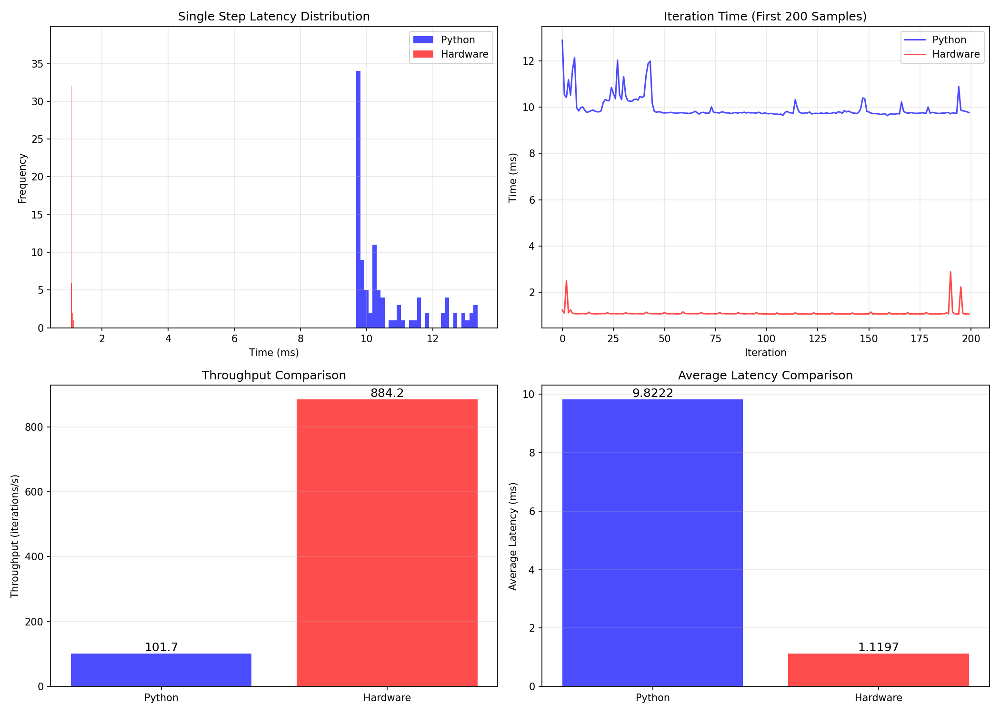
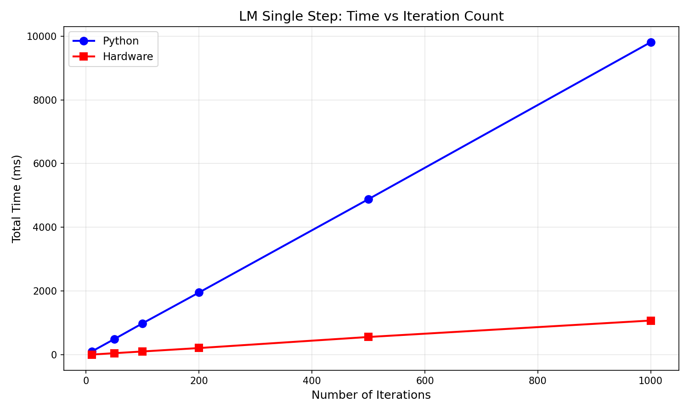
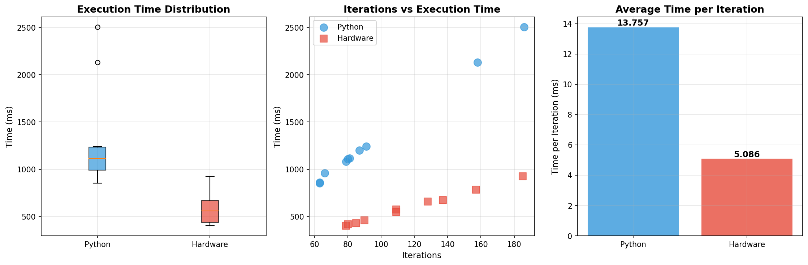
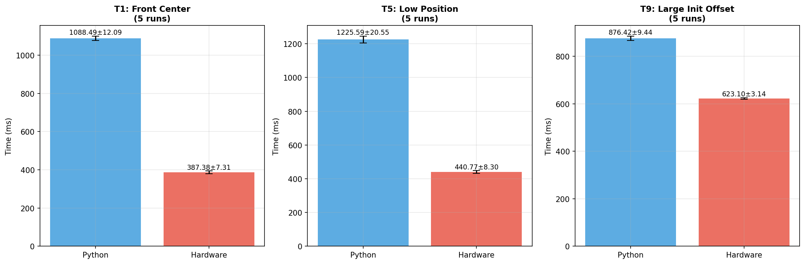

# 基于 LeRobot 的运动学逆解硬件加速系统

Hardware-Accelerated System for Kinematic Inverse Solution Based on LeRobot

[](https://www.pynq.io/)
[](https://www.xilinx.com/products/design-tools/vitis.html)
[](LICENSE)

## 📋 项目概述

本系统是 **2025年FPGA创新与系统设计大赛AMD赛道** 的**全国一等奖参赛**作品，该作品对初赛阶段所使用的 Cholesky 算子进行了深度集成与应用扩展。

在初赛中，我们的 Cholesky 算子优化效果显著，拿到了Cholesky优化任务的**best**！以下为性能指标对比（详见仓库：[hlstrack2025_46387](https://github.com/E1pco/hlstrack2025_46387)）：

#### Cholesky 算子性能对比

| 性能指标 | 优化前 | 优化后 | 改善幅度 |
|---------|--------|--------|----------|
| **延迟 (Latency)** | 4919 | 991 | 79.9% |
| **执行时间** | 30871 | 4731 | 84.7% |
| **启动间隔 (II)** | 696 | 124 | 82.2% |
| **吞吐率 (Throughput)** | 2.3e5 | 1.6e6 | 596% |

**具身智能**是制造业未来发展的重要方向，而**机械臂控制**作为其基础环节，涉及如何驱动机械臂从当前位姿运动至目标位姿。该过程需要通过位姿差值求解各关节舵机应旋转的角度，即**运动学逆解问题**。为此，我们自主设计了运动学逆解 IP 核，部署于 PYNQ-Z2 板卡的 PL 端，充分利用其高度并行计算能力，实现对逆解过程的硬件加速。

### 🎯 核心特性

- ✅ **硬件加速**：基于 FPGA 的 Levenberg-Marquardt 逆运动学求解器
- ✅ **高性能**：单步迭代速度提升约 **10倍**（相比纯软件执行）
- ✅ **优化策略**：应用 PIPELINE、UNROLL 等 HLS 优化技术
- ✅ **完整方案**：包含机械臂控制、遥操作、性能测试等完整功能
- ✅ **易于部署**：基于 PYNQ 框架，Jupyter Notebook 交互式开发

### 🔬 优化方法

在优化策略上，我们在应用 PIPELINE 与 UNROLL 等基础优化方法的同时，借鉴了先前在 Cholesky 算子硬件加速中积累的优化经验，充分挖掘板卡的运算潜力。经对比测试，优化后的逆解算子运行于 PL 端时，平均每步迭代速度相较于纯软件（全部在 PS 端执行）提升约 **10倍**。

### 📊 项目展示

本项目的海报和流程图如下：

<div align="center">
  
  <p><em>图1: 项目海报</em></p>
</div>

<div align="center">
  
  <p><em>图2: 系统设计流程图</em></p>
</div>

---

## 📁 项目结构

```
Hardware-Accelerated_System_for_IK_Solution_Based_on_LeRobot/
├── notebook/                                    # Jupyter 笔记本和比特流文件
│   ├── design_1.bit                            # FPGA 比特流文件
│   ├── design_1.hwh                            # 硬件描述文件
│   ├── Dual_Arm_TCP_Receiver.ipynb             # 遥操双臂控制笔记本
│   ├── LM_SingleStep_Benchmark.ipynb           # 单步逆解性能测试
│   ├── SO101_Hardware_IK_Demo.ipynb            # 完整逆解演示
│   ├── SO101_IK_HW_vs_Python.ipynb             # 硬件加速与 Python 性能对比
│   └── test_results/                           # 性能测试结果图表
│       ├── benchmark_hw_vs_py.png              # 硬件 vs 软件性能对比
│       ├── ik_repeat_test.png                  # 重复性测试结果
│       ├── ik_solver_comparison.png            # 求解器对比
│       ├── ik_solver_distribution.png          # 求解分布图
│       ├── lm_scaling_benchmark.png            # LM 算法扩展性测试
│       └── lm_single_step_benchmark.png        # 单步性能基准测试
│
├── others/                                      # 辅助脚本、驱动和工具
│   ├── driver/                                 # 舵机驱动和配置文件
│   │   ├── ftservo_controller.py               # FeeTech 舵机控制器
│   │   ├── ftservo_driver.py                   # FeeTech 舵机驱动
│   │   ├── __init__.py                         # Python 包初始化
│   │   ├── left_arm.json                       # 左臂配置文件
│   │   └── right_arm.json                      # 右臂配置文件
│   ├── hw_solver_wrapper.py                    # 硬件求解器 Python 封装
│   ├── ik/                                     # 纯 Python 逆运动学实现
│   │   ├── base.py                             # 基础类和数据结构
│   │   ├── et.py                               # 基本变换（Elementary Transform）
│   │   ├── __init__.py                         # 包初始化
│   │   ├── robot.py                            # 机器人运动学模型
│   │   ├── solvers.py                          # IK 求解器实现
│   │   └── utils.py                            # 工具函数
│   ├── joycon_robotics/                        # JoyCon 手柄驱动
│   ├── TCP.py                                  # TCP 客户端（PC 端）
│   ├── poster.png                              # 项目海报
│   └── flowchart.png                           # 流程图
│
├── src/                                         # 源代码
│   ├── ik_solver_hls/                          # HLS 硬件逆解器实现
│   │   ├── description.json                    # IP 核描述文件
│   │   ├── hls_config.cfg                      # HLS 配置文件
│   │   ├── lm_solver_so101.hpp                 # LM 求解器头文件
│   │   ├── tb.cpp                              # C++ 测试平台
│   │   ├── vitis-comp.json                     # Vitis 组件配置
│   │   ├── xf_solver_L1.hpp                    # Vitis L1 库头文件
│   │   └── xf_solver_lm_so101.cpp              # 硬件求解器实现代码
│   └── overlay/                                # Vivado 项目文件
│       ├── design_1.tcl                        # Block Design 构建脚本
│       └── ik.tcl                              # Vivado 构建脚本
│
└── README.md                                    # 项目说明文档（本文件）
```

---

## 🛠️ 硬件要求

### 必需硬件

| 硬件 | 型号/规格 | 说明 |
|------|----------|------|
| **FPGA 开发板** | PYNQ-Z2 | Xilinx Zynq-7020 SoC |
| **机械臂** | SO-101 (x2) | 5自由度机械臂（包含舵机、驱动板和结构件） |
| **舵机驱动板** | FeeTech 兼容 | 用于控制舵机 |
| **PC 电脑** | 带蓝牙和千兆网口 | 用于开发和遥操作 |

### 可选硬件

| 硬件 | 说明 |
|------|------|
| **JoyCon 手柄** | 一对 Nintendo Switch JoyCon，用于遥操作演示 |
| **网线** | 千兆网线，用于连接 PC 和 PYNQ 板卡 |

---

## 💻 软件要求

### PYNQ 环境

- **PYNQ 版本**: 2.7 或更高（适用于 PYNQ-Z2）
- **Python 版本**: 3.6+
- **Jupyter Notebook**: 已包含在 PYNQ 镜像中

### Python 依赖库

主要依赖包括：

```python
# 核心依赖
numpy>=1.19.0
scipy>=1.5.0

# 硬件接口
pynq>=2.7.0

# 舵机控制（自定义）
driver.ftservo          # FeeTech 舵机驱动

# 逆运动学求解（自定义）
ik.robot                # 机器人运动学模型
ik.utils                # 工具函数
ik.solvers              # IK 求解器
ik.et                   # 基本变换

# 硬件求解器封装（自定义）
hw_solver_wrapper       # 顶层封装函数
```

### 开发工具（可选）

如果需要重新编译 HLS IP 核：

- **Vitis HLS**: 2021.2 或更高
- **Vivado**: 2021.2 或更高

---

## 🚀 快速开始

### 步骤 1: 硬件连接

1. **蓝牙连接**（可选）：将 JoyCon 手柄与 PC 通过蓝牙配对
2. **网络连接**：使用千兆网线连接 PC 和 PYNQ-Z2 板卡
3. **舵机连接**：将 PYNQ 板卡与舵机驱动板通过 UART 接口连接
4. **电源连接**：
   - 为 PYNQ-Z2 板卡供电（5V/2A）
   - 为舵机驱动板供电（根据舵机规格）

### 步骤 2: 文件上传

将以下文件夹和文件上传到 PYNQ-Z2 板卡（通过 Jupyter 或 SSH）：

```bash
# 上传到板卡的 /home/xilinx/ 目录
notebook/                    # 包含 .bit、.hwh 和 .ipynb 文件
others/driver/               # 舵机驱动
others/ik/                   # 逆运动学库
others/hw_solver_wrapper.py  # 硬件求解器封装
```

### 步骤 3: 启动 Jupyter Notebook

1. 在浏览器中打开 PYNQ 板卡的 Jupyter Notebook：
   ```
   http://<PYNQ-IP>:9090
   ```
   默认密码：`xilinx`

2. 导航到 `notebook/` 文件夹

### 步骤 4: 运行演示

选择以下任一笔记本运行：

#### 🎮 演示笔记本

- **`SO101_Hardware_IK_Demo.ipynb`**  
  完整的硬件加速逆运动学演示，展示如何使用 FPGA 加速 IK 求解

- **`Dual_Arm_TCP_Receiver.ipynb`**  
  双臂遥操作演示（需要 JoyCon 手柄）

#### 📊 性能测试笔记本

- **`SO101_IK_HW_vs_Python.ipynb`**  
  硬件加速与纯 Python 软件的性能对比

- **`LM_SingleStep_Benchmark.ipynb`**  
  单步 LM 迭代性能基准测试

### 步骤 5: 查看结果

运行笔记本后，性能测试结果会保存在 `notebook/test_results/` 文件夹中。

---

## 📈 性能数据

### 性能提升总结

经过对比测试发现，相比于纯软件实现（算法完全在 PS 端执行），经过硬件加速的逆解算法在 PL 端并行执行时表现出显著的性能提升：

| 性能指标 | 纯软件 (PS) | 硬件加速 (PL) | 加速比 |
|---------|------------|--------------|--------|
| **单步迭代速度** | 基准 | 提升 | **~10x** |
| **平均迭代时间** | 基准 | 减少 | **~7.9x** |
| **吞吐率** | 基准 | 提升 | **~9.2x** |
| **整体加速比** | 1.0x | 加速 | **~2.5x** |

> **注**：具体性能数据可能因测试场景和目标位姿而异。详细的图表数据请参见 `notebook/test_results/`。

### 性能测试方法

所有性能数据均通过运行以下笔记本获得：

- `LM_SingleStep_Benchmark.ipynb` - 单步性能测试
- `SO101_IK_HW_vs_Python.ipynb` - 完整求解性能对比

### 性能图表

<div align="center">
  
  <p><em>图3: 单步 LM 算法性能基准测试</em></p>
</div>

<div align="center">
  
  <p><em>图4: LM 算法扩展性能测试</em></p>
</div>

<div align="center">
  
  <p><em>图5: IK 求解器性能对比</em></p>
</div>

<div align="center">
  
  <p><em>图6: IK 解分布分析</em></p>
</div>

<div align="center">
  
  <p><em>图7: IK 求解器重复性测试结果</em></p>
</div>

---

## 🏗️ 系统架构

### 硬件架构

```
┌─────────────────────────────────────────────────────────┐
│                    PYNQ-Z2 开发板                        │
│  ┌──────────────────────────┬──────────────────────┐   │
│  │      Processing System   │  Programmable Logic  │   │
│  │          (PS)            │        (PL)          │   │
│  │                          │                      │   │
│  │  • Python 控制代码       │  • IK 求解器 IP 核   │   │
│  │  • Jupyter Notebook      │  • AXI-Lite 接口     │   │
│  │  • 驱动程序              │  • 并行计算单元      │   │
│  │                          │  • Cholesky 分解     │   │
│  └────────┬─────────────────┴───────┬──────────────┘   │
│           │        AXI 总线         │                   │
└───────────┼─────────────────────────┼───────────────────┘
            │                         │
            ▼                         ▼
      UART 接口                  MMIO 寄存器
            │                         │
            ▼                         ▼
     舵机驱动板                  配置/控制
```

### 软件架构

```
┌─────────────────────────────────────────────────────┐
│              Jupyter Notebook 层                     │
│  (用户交互、可视化、演示)                            │
└────────────────┬────────────────────────────────────┘
                 │
┌────────────────▼────────────────────────────────────┐
│           Python 应用层                              │
│  • robot.py      - 机器人模型                       │
│  • solvers.py    - 软件 IK 求解器                   │
│  • hw_solver_wrapper.py - 硬件求解器封装            │
└────────────────┬────────────────────────────────────┘
                 │
┌────────────────▼────────────────────────────────────┐
│           硬件抽象层 (HAL)                           │
│  • PYNQ Overlay  - 比特流加载                       │
│  • MMIO          - 寄存器访问                       │
│  • driver        - 舵机控制                         │
└────────────────┬────────────────────────────────────┘
                 │
┌────────────────▼────────────────────────────────────┐
│              FPGA 硬件层                             │
│  • xf_solver_lm_so101 IP 核                         │
│  • AXI-Lite 从接口                                  │
└─────────────────────────────────────────────────────┘
```

---

## 🔧 IP 核接口说明

### AXI-Lite 寄存器映射

硬件 IK 求解器通过 AXI-Lite 接口访问，寄存器映射如下：

#### 输入寄存器

| 偏移地址 | 名称 | 类型 | 说明 |
|---------|------|------|------|
| 0x10 | sin0 | float | 关节 0 角度的正弦值 |
| 0x18 | sin1 | float | 关节 1 角度的正弦值 |
| 0x20 | sin2 | float | 关节 2 角度的正弦值 |
| 0x28 | sin3 | float | 关节 3 角度的正弦值 |
| 0x30 | sin4 | float | 关节 4 角度的正弦值 |
| 0x38 | cos0 | float | 关节 0 角度的余弦值 |
| 0x40 | cos1 | float | 关节 1 角度的余弦值 |
| 0x48 | cos2 | float | 关节 2 角度的余弦值 |
| 0x50 | cos3 | float | 关节 3 角度的余弦值 |
| 0x58 | cos4 | float | 关节 4 角度的余弦值 |
| 0x60 | e0 | float | 误差向量分量 0 |
| 0x68 | e1 | float | 误差向量分量 1 |
| 0x70 | e2 | float | 误差向量分量 2 |
| 0x78 | e3 | float | 误差向量分量 3 |
| 0x80 | e4 | float | 误差向量分量 4 |
| 0x88 | e5 | float | 误差向量分量 5 |
| 0x90 | lambda | float | LM 阻尼因子 |

#### 输出寄存器

| 偏移地址 | 名称 | 类型 | 说明 |
|---------|------|------|------|
| 0x98 | d0 | float | 关节增量 0 |
| 0xA8 | d1 | float | 关节增量 1 |
| 0xB8 | d2 | float | 关节增量 2 |
| 0xC8 | d3 | float | 关节增量 3 |
| 0xD8 | d4 | float | 关节增量 4 |
| 0xE8 | status | int | 执行状态码（0=成功，1=失败） |
| 0xF0 | state | int | 运行状态（位标志） |

### 使用示例

```python
from pynq import Overlay

# 加载比特流
overlay = Overlay('design_1.bit')

# 访问 IK 求解器
solver_ip = overlay.xf_solver_lm_so101_0

# 写入输入数据
solver_ip.write(0x10, sin_values[0])  # sin0
solver_ip.write(0x60, error[0])       # e0
solver_ip.write(0x90, lambda_value)   # lambda

# 启动计算（写入控制寄存器）
solver_ip.write(0x00, 0x01)

# 等待完成
while not (solver_ip.read(0x00) & 0x02):
    pass

# 读取结果
delta = [solver_ip.read(0x98 + i*0x10) for i in range(5)]
status = solver_ip.read(0xE8)
```

---

## 📚 参考文献

1. **Wei Liu** - PYNQ 中文资料  
   GitHub: https://github.com/louisliuwei/PynqDocs

2. **Wei Liu** - FPGA 并行编程  
   GitHub: https://github.com/sazczmh/pp4fpgas-cn

3. **AMD, Inc.** - Vitis 高层次综合用户指南 (UG1399)  
   文档: https://docs.amd.com/r/en-US/ug1399-vitis-hls/HLS-Programmers-Guide

4. **LeRobot** - Hugging Face 机器人学习框架  
   GitHub: https://github.com/huggingface/lerobot

5. **JoyCon Robotics** - Nintendo Switch JoyCon 机器人控制库  
   GitHub: https://github.com/box2ai-robotics/joycon-robotics

6. **hlstrack2025** - 初赛 Cholesky 算子优化  
   GitHub: https://github.com/E1pco/hlstrack2025_46387

---

## 📝 许可证

本项目采用 MIT 许可证 - 详见 [LICENSE](LICENSE) 文件

---

## 👥 贡献者

感谢所有为本项目做出贡献的开发者！

如有问题或建议，欢迎提交 Issue 或 Pull Request。

---

## 🙏 致谢

特别感谢：

- AMD/Xilinx 提供的开发工具和技术支持
- PYNQ 社区提供的开源框架
- 所有参考项目的作者和贡献者

---

<div align="center">
  <p>⭐ 如果这个项目对您有帮助，请给我们一个星标！</p>
  <p>Made with ❤️ by Hardware-Accelerated IK Team</p>
</div>
